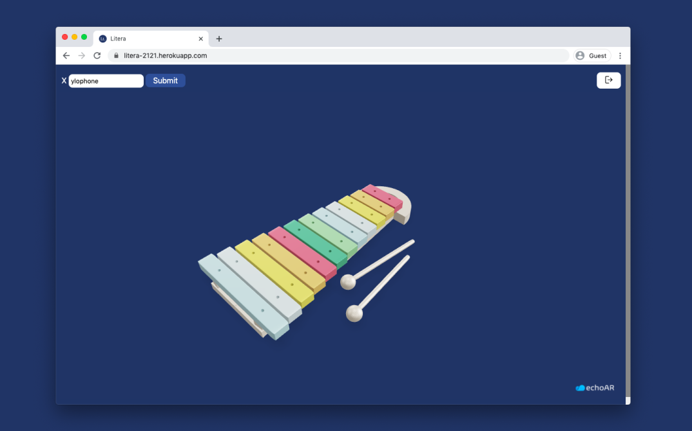

<p align="center">
  
</p>

<h3 align="center">
    <i>
        An echoAR Web App for visual learners
    </i>
</h3>

<p align="center">
  
  
  
  
  
  
  
</p>

<hr>

## ✨ In Action

<p align="center">
  
</p>

## 💻 Try it out

```sh
git clone https://github.com/RGBHack/Litera.git
npm i
npm run start
```

## 👨‍💻 Authors

**Aadit Gupta, Rohan Juneja, Raadwan Masum, Safin Singh**

## 🤝 Contributing

Contributions, PRs, issues and feature requests are welcome! Feel free to check out our [issues page](https://github.com/RGBHack/Litera/issues).

## ❤️ Show your support

Give a ⭐️ if this project helped you!
Hope you enjoy it!
